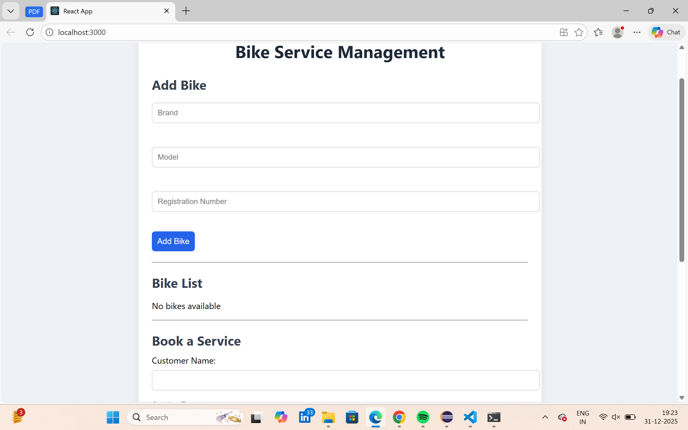
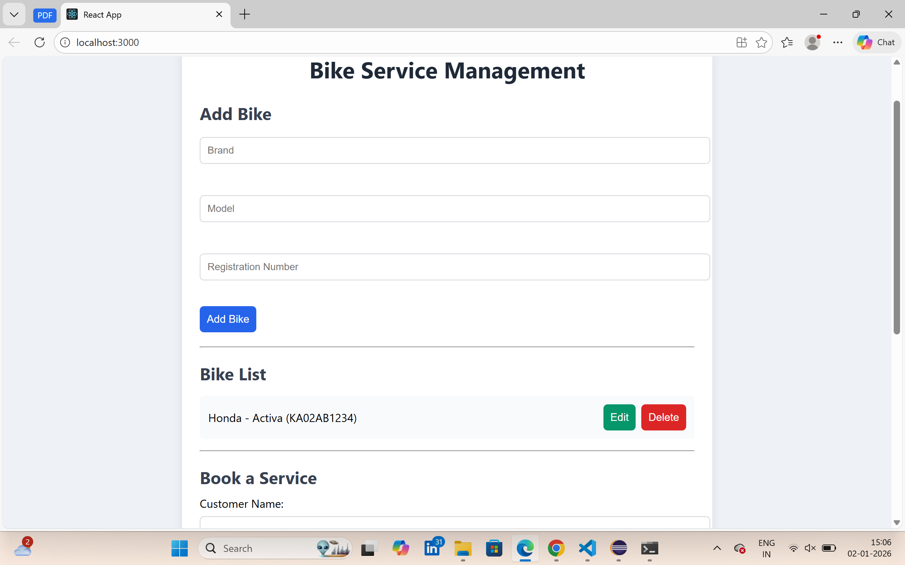
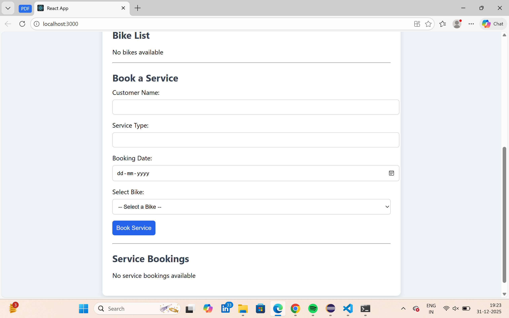
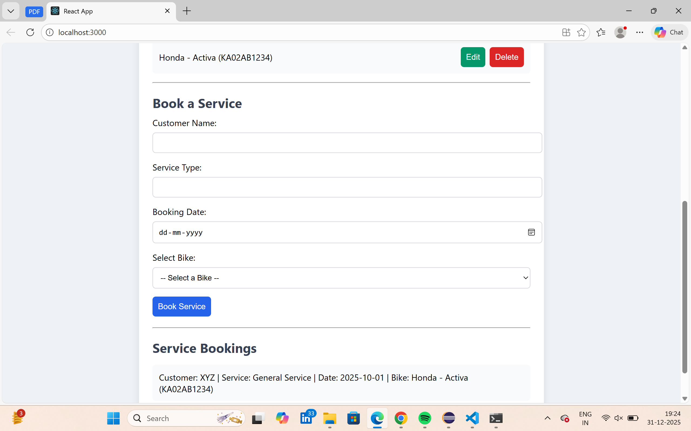

# 🚲 Bike Service Management – Frontend

A React.js frontend application for managing bikes and service bookings.  
It provides a clean UI to interact with the Spring Boot backend APIs.

---

## ⚡ Features

- Add, view, update, and delete bikes
- View service bookings
- Responsive and user-friendly interface
- Integration with backend REST APIs

---

## 🛠️ Tech Stack

- React.js
- JavaScript (ES6)
- HTML5 / CSS3
- Fetch API (for backend communication)
- Node.js & npm

---

## 🚀 How to Run

### 1️⃣ Open terminal in the frontend folder

```bash
cd bike-service-frontend
```

### 2️⃣ Install dependencies
```bash 
npm install
```

### 3️⃣ Start the frontend
```bash
npm start
```

### 4️⃣ Frontend runs on
http://localhost:3000

Make sure the backend is running on http://localhost:8080 before using the frontend.

## 📡 Features in Action

### Add Bike

### Bike List - EDIT/DELETE

### Book Service

### Service Bookings List

